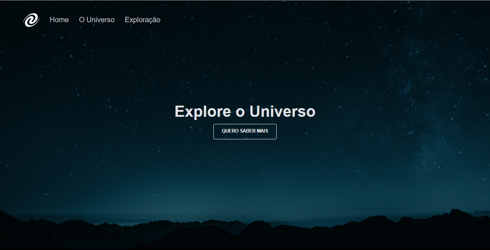
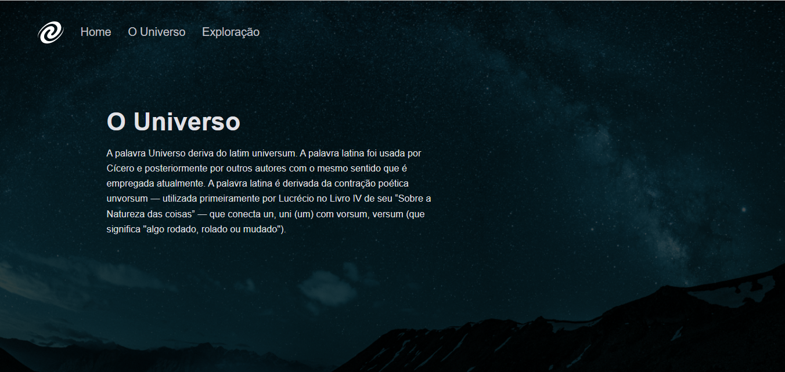
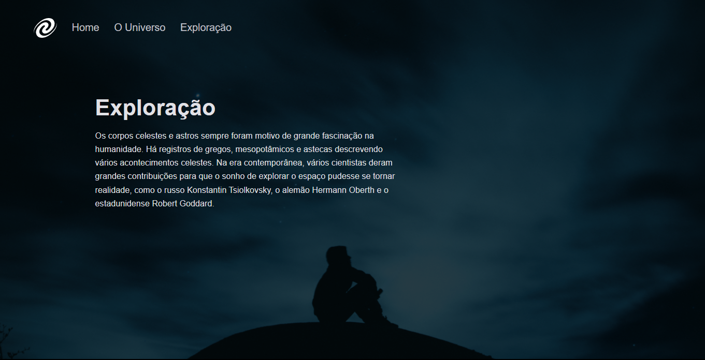

<h1 align="center">SPA Universe</h1>

Desafio proposto pela equipe de instrutores da Rocketseat para o EXPLORER, para uma melhor compreensão do HTML, CSS e JavaScript. 

  <a href="#-Technologies">Technologies</a>&nbsp;&nbsp;&nbsp;|&nbsp;&nbsp;&nbsp;
  <a href="#-Project">Project</a>&nbsp;&nbsp;&nbsp;|&nbsp;&nbsp;&nbsp;
  <a href="#memo-License">License</a>

 

  
  
  

## 🚀 Technologies

Este projeto foi desenvolvido com as seguintes tecnologias:

- HTML and CSS;
- JavaScript;
- JSon;
- Figma;
- Git e GitHub;

## 💻 Project

O SPA Universe foi desenvolvido para estudar o uso de SPA(Single Page Application). Neste projeto, construimos uma Lan Page com roteamento de paginas. Entre os temas mais comuns estão:

- Animação em CSS;
- Funções, refatoração e modulação em JavaScript;
- DOM manipulation;
- Conceitos de SPA;
- Mapeamento de rotas;
- Assíncrono e promises;
- Orientação a objetos.

## 🔖 Layout

Você pode visualizar o layout do projeto através [DESSE LINK](https://www.figma.com/file/m8zp3mtxvwyTGQs69nIFM8/%5BDesafios-Explorer%5D-SPA-Universe/duplicate). É necessário ter conta no [Figma](https://figma.com) para acessá-lo.

## 🔗 Link

 

## 📝 Licença

 
Esse projeto está sob a licença MIT.

---
Feito com ♥ by Rocketseat 👋 [Participe da nossa comunidade!](https://discord.gg/rocketseat)

# Desafio 1 Stage6-Explorer-Rocketseat
